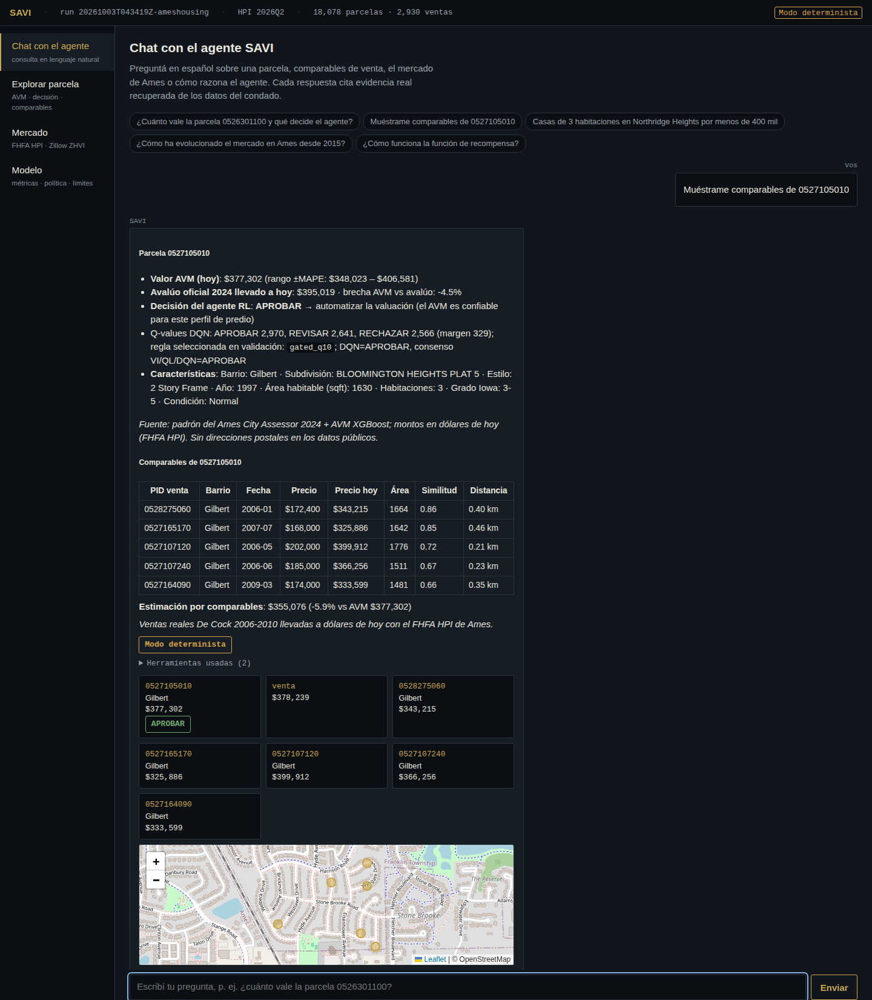
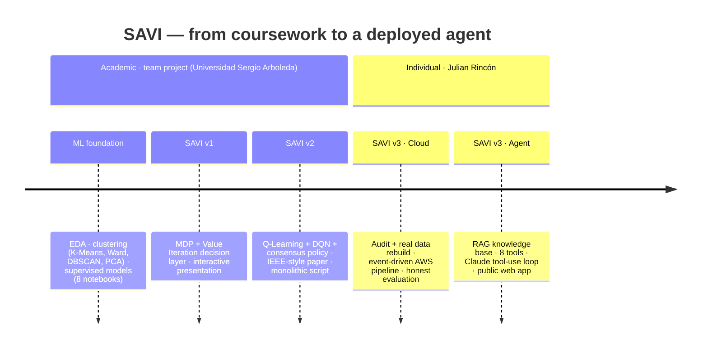
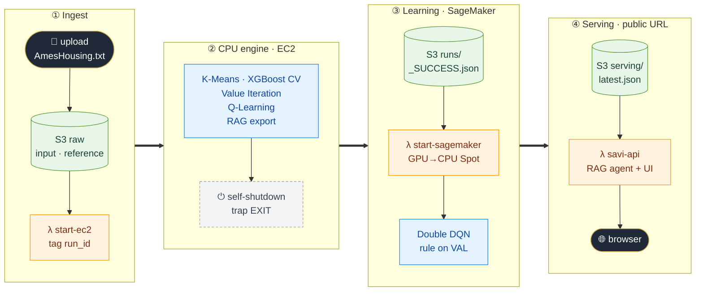
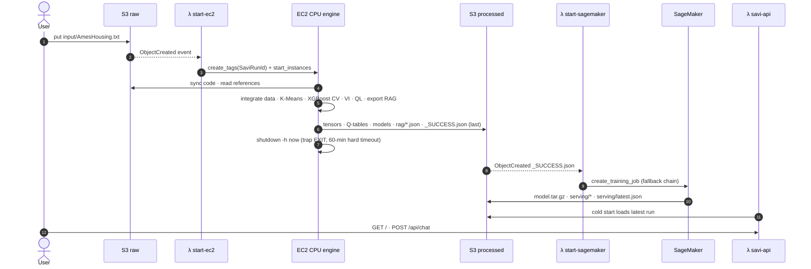
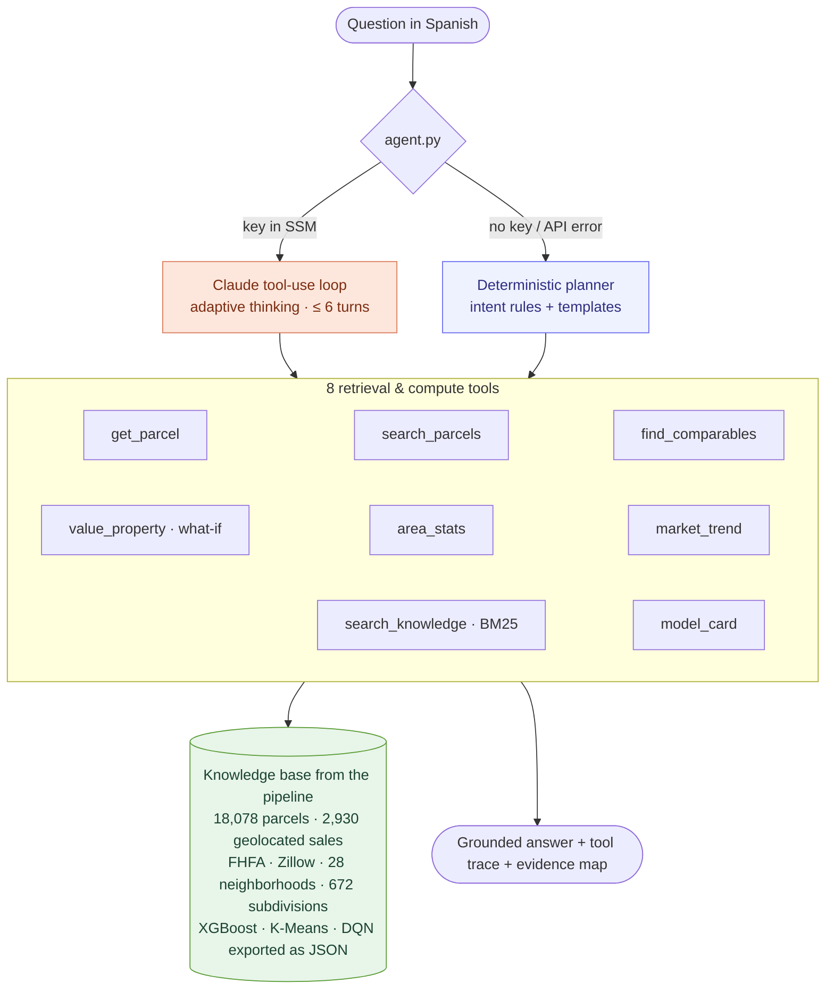
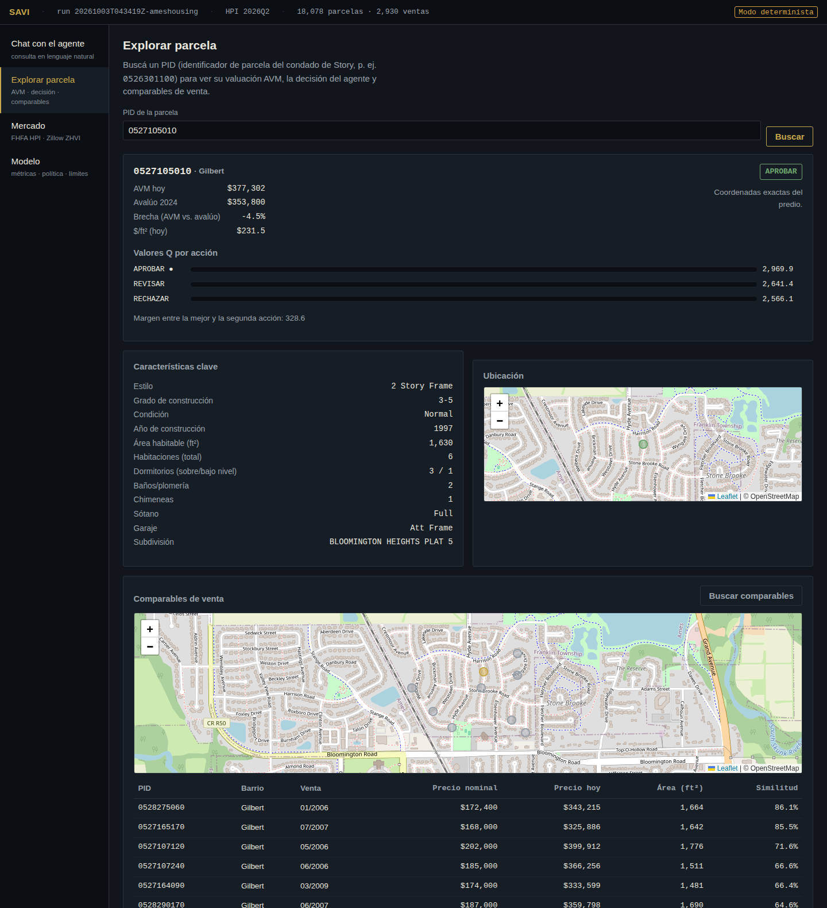
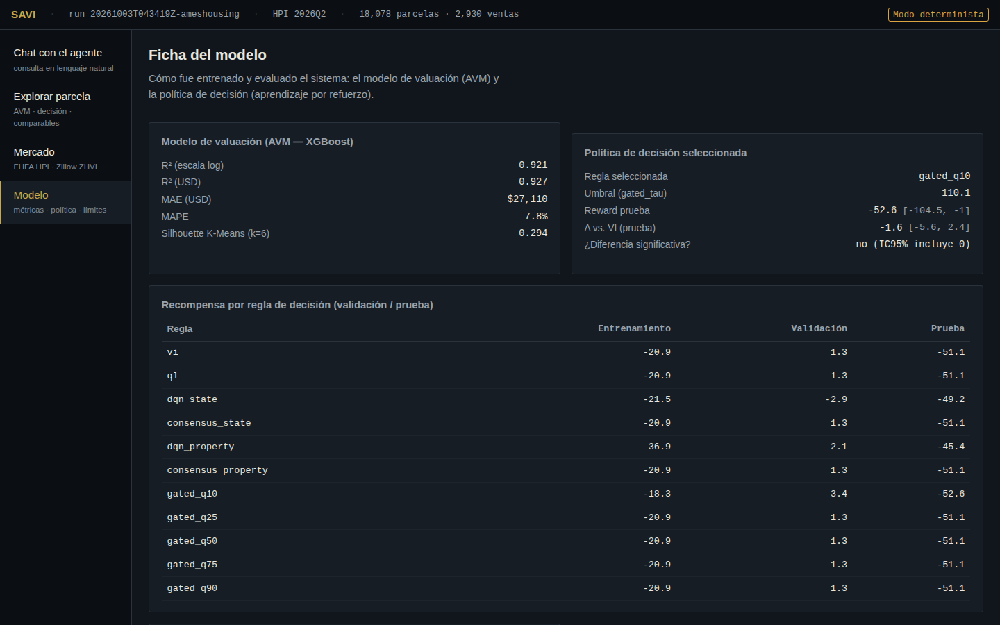
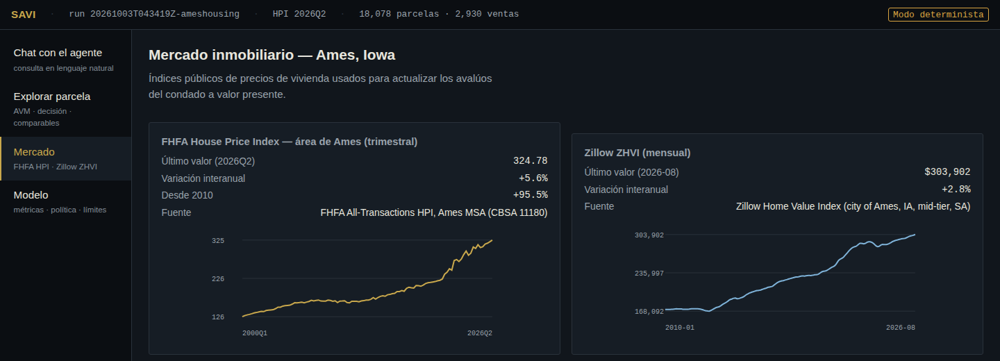

<div align="center">

# 🏠 SAVI — Autonomous Real-Estate Valuation Agent

**From a university ML notebook to a cloud-native, event-driven RL + RAG agent on AWS**
*Ames, Iowa · 18,078 parcels · 2,930 real sales · XGBoost · Value Iteration · Q-Learning · Double DQN · Claude*

[](https://5w442qdw5roag3chtm6esbohfu0mwaap.lambda-url.us-east-1.on.aws/)
[](https://github.com/Julian-Rincon/ames-housing-ml/actions/workflows/cloud-ci.yml)
[](cloud/tests)


<a href="https://5w442qdw5roag3chtm6esbohfu0mwaap.lambda-url.us-east-1.on.aws/">
  
</a>

</div>

---

## ✨ At a glance

| | |
|---|---|
| **Problem** | An Automated Valuation Model (AVM) predicts a house price — but *when should a lender trust it?* SAVI learns, with reinforcement learning, whether to **APPROVE** the automatic valuation, send it to a human **REVIEW**, or **REJECT** it and ask for more data, based on the economic cost of being wrong. |
| **v3 (individual)** | Re-engineered the academic monolith into an **event-driven AWS pipeline** (S3 → Lambda → EC2 → Lambda → SageMaker), rebuilt the dataset from **real public sources**, and shipped a **RAG agent API + web app** on a public URL. |
| **Data** | 2,930 real sales (De Cock 2006–2010) joined by parcel ID to the **2024 Ames City Assessor roll** (18,078 parcels), price-indexed to 2026 dollars with the **FHFA HPI**, geolocated, plus Zillow ZHVI. |
| **Models** | XGBoost AVM (5-fold out-of-fold **R²(log) = 0.921 · MAPE 7.8 %**), K-Means market states, MDP Value Iteration, tabular Q-Learning, PyTorch **Double DQN**, decision rule selected on a held-out validation split. |
| **Engineering** | boto3 IaC, self-terminating EC2 with cost guards, SageMaker Spot with checkpoints, idempotent runs, stdlib-only inference in Lambda that reproduces the models **exactly**, 191 tests, GitHub Actions CI. |

> 🇪🇸 **Resumen:** SAVI empezó como proyecto académico en equipo (v1–v2) y en la **v3** lo convertí, de forma individual, en un sistema cloud-native en AWS con datos reales de Ames, un pipeline orientado a eventos, evaluación estadística honesta y un **agente RAG** desplegado con interfaz web pública.

---

## 🧭 Project evolution



| Version | Authors | What it is | Key result |
|---|---|---|---|
| **ML foundation** | Team | 8 notebooks: EDA, clustering, regression/classification baselines | Segmentation + supervised baselines |
| **SAVI v1** | Team | MDP over K-Means market states, solved with Value Iteration | First risk-aware APPROVE / REVIEW / REJECT policy |
| **SAVI v2** | Team | Monolithic script: XGBoost + VI + Q-Learning + DQN + consensus vote, IEEE paper | Full RL pipeline (academic final project) |
| **SAVI v3** | **Julian Rincón (solo)** | Cloud-native pipeline on AWS + real-data rebuild + RAG agent API and web app | Live demo · R²(log) 0.921 on real sales · 191 tests |

<details>
<summary><b>What changed from v2 to v3 (audit findings)</b></summary>

- **Data integrity.** An audit found that **93 % of the rows** of the v2 dataset (`ames_combined_2006_2024.csv`) were 2024 assessor records padded with **61 constant columns** (e.g. every row `Neighborhood = NAmes`, `LotArea = 9000`), and their `SalePrice` was the **assessed value**, not a sale. v2's R² = 0.96 reflected that artifact. v3 rebuilds the dataset from real sources joined by parcel ID.
- **Three bugs** prevented the v2 script from running end-to-end (invalid f-string format spec, `.values` on a NumPy array, the removed `squared=False` in scikit-learn ≥ 1.6).
- The "Double DQN" was a vanilla DQN with a target network → now a **true Double DQN** (online net selects, target net evaluates).
- ε decayed **per step** (reached 0.05 after ~600 of ~3M steps) → now per epoch.
- The DQN learned from **in-sample** errors and LightGBM early-stopped on the test set → **out-of-fold** errors and no test leakage.
- Q-Learning with constant α = 0.1 and rewards up to −2000 was noise-dominated → visit-count decaying α; it now converges to the Value-Iteration policy.

</details>

---

## ☁️ v3 architecture — event-driven, pay-per-use



<details>
<summary><b>One run, step by step (sequence diagram)</b></summary>



</details>

**Measured on AWS (verified hands-off run):** EC2 engine **49 s** then self-stops · SageMaker Spot **288 billable s** · full run **< US$0.05**.

**Built for a constrained account (AWS Academy Learner Lab)** — every limitation found was verified live and handled in code:

| Constraint discovered | How v3 handles it |
|---|---|
| No `iam:CreateRole` | Uses the pre-provisioned `LabRole`; least-privilege policies shipped as JSON in [`cloud/infra/iam/`](cloud/infra/iam) |
| SageMaker GPU types explicitly denied (despite quota) | Lambda fallback chain GPU Spot → GPU → **CPU Spot** → CPU; same training script |
| `aws:SourceAccount` condition silently blocks S3 → Lambda | Permission scoped by bucket ARN only |
| EC2 instances **restart** when a lab session starts | Idempotent runs: if `runs/<id>/_SUCCESS.json` exists the instance shuts down without work |
| Amazon Bedrock blocked | Claude via the Anthropic API with the key in SSM; deterministic fallback when no key |

---

## 🤖 The RAG agent

**Live:** <https://5w442qdw5roag3chtm6esbohfu0mwaap.lambda-url.us-east-1.on.aws/> — one Lambda Function URL serves the web app (`/`) and the JSON API (`/api/*`).



- **Every number is retrieved, never invented**: answers cite parcel/sale IDs and sources and show the tools used.
- **Exact models without heavy dependencies**: XGBoost trees, K-Means and the DQN network are evaluated in **pure Python** from JSON (float32 split semantics). Verified against the pipeline on all 18,078 parcels: AVM Δ ≤ **0.003 %**, **0** cluster mismatches, **0** decision mismatches, |ΔQ| < 0.006.
- **Comparable sales** combine feature similarity and haversine distance, and produce an independent **comps-based estimate** that is cross-checked against the AVM.
- **What-if valuation**: change living area, year, grade, condition or neighborhood and get a new value, range (±MAPE), market state and agent decision, with the assumptions listed explicitly.
- Cost controls on a public endpoint: reserved concurrency, turn cap, bounded tokens.

<table>
<tr>
<td width="50%"><br><sub><b>Parcel explorer</b> — AVM vs assessment, RL decision with Q-values, comparable sales on a map, what-if.</sub></td>
<td width="50%"><br><sub><b>Model card</b> — AVM metrics and reward per decision rule on train / validation / test.</sub><br><br><br><sub><b>Market</b> — FHFA HPI (quarterly) and Zillow ZHVI (monthly) for Ames.</sub></td>
</tr>
</table>

---

## 📊 Results — measured honestly

**Valuation model (AVM).** Real sales only, prices in 2026Q2 dollars, 5-fold cross-validation with out-of-fold predictions:

| Model | R² (log) | R² (USD) | MAE | MAPE |
|---|---:|---:|---:|---:|
| **XGBoost** (selected) | **0.921** | **0.927** | **$27,110** | **7.8 %** |
| LightGBM | 0.912 | 0.911 | $29,053 | 8.3 % |

**Decision policy (RL).** Sales are split 70 / 15 / 15, stratified by market state. Agents learn on *train*, the decision rule is chosen on *validation*, and *test* is reported once with a bootstrap 95 % CI:

| Decision rule | Train | Validation | Test |
|---|---:|---:|---:|
| Value Iteration = Q-Learning | −20.9 | 1.3 | −51.1 |
| Double DQN, per property | **+36.9** | 2.1 | −45.4 |
| Confidence-gated DQN (selected on validation) | −18.3 | 3.4 | −52.6 |
| *Oracle (upper bound)* | *142.6* | *149.5* | *143.1* |

> **Takeaway:** the per-property DQN **overfits** (train +36.9 → test −45.4) and **no rule beats Value Iteration significantly** on unseen sales (Δ = −1.6, 95 % CI [−5.6, 2.4]). The promising gains of v2 came largely from in-sample evaluation. The gap to the oracle shows the information that would matter most is not in the current features.

---

## 🛠️ Engineering quality

- **191 automated tests** (146 pipeline + 45 API): reward semantics, MDP/VI/QL, Double-DQN targets, checkpoint resume, Lambda handlers with `botocore.Stubber`, EC2 boot scripts with stubbed `aws`/`shutdown`, IaC dry-run, and end-to-end runs on real data.
- **CI** on GitHub Actions (Python 3.11 + 3.12): shellcheck, tests, Lambda package build, deployment dry-run; actions pinned by SHA.
- **Infrastructure as code** with boto3: idempotent `deploy.py` (with `--dry-run`), `teardown.py`, least-privilege IAM documents.
- **Cost and safety guards**: EC2 with no inbound ports (SSM only) and a guaranteed `trap`-based shutdown, SageMaker Spot with S3 checkpoints, 30-day artifact lifecycle, 14-day log retention, API secrets in SSM SecureString.
- **Integration contracts** ([`CONTRACT.md`](cloud/CONTRACT.md), [`RAG_CONTRACT.md`](cloud/RAG_CONTRACT.md)) so each component can be developed and tested in isolation.

---

## 🗂️ Repository structure

```text
.
├── cloud/                         # ★ SAVI v3 (individual) — see cloud/README.md
│   ├── savi_cpu_pipeline.py       #   EC2 engine: data integration, K-Means, XGBoost, VI, Q-Learning
│   ├── savi_gpu_sagemaker.py      #   SageMaker engine: Double DQN, rule selection, serving export
│   ├── savi_rag_export.py         #   knowledge base for the agent (rag/*.json)
│   ├── utils.py                   #   shared rewards, policies, splits, bootstrap
│   ├── lambdas/                   #   event triggers (S3 → EC2, S3 → SageMaker)
│   ├── ec2/                       #   user-data + systemd run script with cost guards
│   ├── api/                       #   RAG agent: savi_api/, handler.py, static/index.html
│   ├── infra/                     #   boto3 deploy / teardown / IAM policies / LLM key helper
│   └── tests/                     #   pipeline tests (api/tests for the agent)
├── SAVI_v2_ParcialFinal.py        # SAVI v2 (team) — monolithic RL pipeline
├── SAVI_v2_ParcialFinal.html      # v2 interactive presentation
├── SAVI_v2_ArticuloIEEE.docx      # v2 IEEE-style paper
├── MDP_Ames_SAVI.py               # SAVI v1 (team) — MDP + Value Iteration
├── MDP_Ames_Presentacion.html     # v1 interactive presentation
├── notebooks/                     # ML foundation (team): 01–08
└── docs/images/                   # screenshots
```

---

## 🚀 Run it

**Try it:** open the [live demo](https://5w442qdw5roag3chtm6esbohfu0mwaap.lambda-url.us-east-1.on.aws/) and ask, for example, *"¿Cuánto vale la parcela 0526301100 y qué decide el agente?"* or *"Casas de 3 habitaciones en Northridge Heights por menos de 400 mil"*.

**Locally (v3):**

```bash
cd cloud
python -m venv .venv && .venv/bin/pip install -r requirements-ec2.txt torch pytest anthropic
# data/input/AmesHousing.txt + data/reference/ (assessor roll, FHFA HPI, geo, Zillow) — see cloud/README.md
.venv/bin/python savi_cpu_pipeline.py --input data/input/AmesHousing.txt --reference data/reference --output out/run
SM_CHANNEL_PROCESSED=out/run SM_MODEL_DIR=out/model .venv/bin/python savi_gpu_sagemaker.py --epochs 30
SAVI_DATA_DIR=out/fixture .venv/bin/python api/local_server.py --port 8080   # rag/ + serving/
```

**On AWS:** `python infra/deploy.py` (idempotent; `--dry-run` to preview), then `aws s3 cp data/input/AmesHousing.txt s3://savi-raw-<account>/input/`. Full guide in [`cloud/README.md`](cloud/README.md).

<details>
<summary><b>Legacy versions (v1 / v2, team)</b></summary>

- v2 interactive presentation: <https://julian-rincon.github.io/ames-housing-ml/SAVI_v2_ParcialFinal.html>
- v1 interactive presentation: <https://julian-rincon.github.io/ames-housing-ml/MDP_Ames_Presentacion.html>

```bash
pip install -r requirements.txt
python MDP_Ames_SAVI.py            # v1: MDP + Value Iteration
python SAVI_v2_ParcialFinal.py     # v2: monolithic RL pipeline (expects AMES_DATASET_PATH)
```

Original notebook results (on the v2 extended dataset, see the data note above):

| Model | Task | Main metric |
|---|---|---|
| LightGBM | Regression | R² = 0.75 |
| Random Forest | Regression | R² = 0.33 |
| SVM | Binary classification | Accuracy = 95 %, F1 = 0.94 |
| K-Means / Ward / DBSCAN / PCA | Segmentation | Elbow, Silhouette, Dunn · PC1 + PC2 = 55 % variance |

</details>

---

## 👥 Authors & credits

| Version | Authors |
|---|---|
| ML foundation · SAVI v1 · SAVI v2 | Academic team project, *Machine Learning*, Universidad Sergio Arboleda (2026): **Julian Rincón**, Valeria Larea, Nicolás Garzón, Juan Niño |
| **SAVI v3** (cloud pipeline, data rebuild, RAG agent, web app) | **Julian Rincón** — individual project · [github.com/Julian-Rincon](https://github.com/Julian-Rincon) |

**Data:** D. De Cock (2011), *Ames, Iowa: Alternative to the Boston Housing Data*, Journal of Statistics Education · City of Ames Assessor (2024 residential roll) · FHFA House Price Index (Ames MSA) · Zillow Home Value Index · coordinates from the `modeldata::ames` R package (tidymodels).
**Disclaimer:** educational project; not an official appraisal or financial advice.
