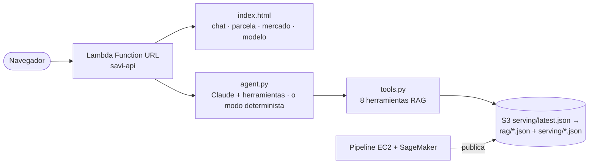

# SAVI v3 · Cloud Native — arquitectura híbrida CPU/GPU en AWS

Migración del monolito `SAVI_v2_ParcialFinal.py` a un pipeline **orientado a eventos** en AWS:
el motor CPU (K-Means, XGBoost, Value Iteration, Q-Learning) corre en una EC2 que se enciende
sola y se apaga sola; el motor GPU (Double DQN + política de consenso) corre como Training Job
de SageMaker en una instancia Spot que se destruye al terminar.

```mermaid
flowchart LR
    U([Usuario]) -- "aws s3 cp AmesHousing.txt" --> RAW[(S3 raw<br/>input/ · reference/ · code/)]
    RAW -- "ObjectCreated input/" --> L1[λ savi-start-ec2]
    L1 -- "tags SaviRunId/SaviInputKey<br/>+ StartInstances" --> EC2[EC2 t3.medium<br/>motor CPU]
    EC2 -- "K-Means · XGBoost · VI · QL<br/>tensores + tablas Q" --> PROC[(S3 processed<br/>runs/&lt;run_id&gt;/)]
    EC2 -. "shutdown -h now" .-> EC2
    PROC -- "ObjectCreated _SUCCESS.json" --> L2[λ savi-start-sagemaker]
    L2 -- "CreateTrainingJob<br/>Spot → On-Demand → CPU" --> SM[SageMaker (GPU o CPU Spot)<br/>Double DQN + regla elegida en VAL]
    SM -- "model.tar.gz<br/>decisiones de cartera" --> PROC
    EC2 & L1 & L2 & SM -. logs .-> CW[(CloudWatch)]
```

## Agente SAVI (RAG) — demo en vivo

**URL pública:** https://5w442qdw5roag3chtm6esbohfu0mwaap.lambda-url.us-east-1.on.aws/
(interfaz web en `/`, API JSON en `/api/*`; Lambda Function URL, sin servidores que mantener)

El agente responde en español sobre las 18,078 parcelas del padrón 2024 de Ames y las 2,930 ventas
reales, **siempre con evidencia recuperada** (RAG) de la base de conocimiento que genera el pipeline:

| Herramienta | Qué recupera / calcula |
|---|---|
| `get_parcel` | Parcela + valor AVM hoy + avalúo + decisión del agente RL (APROBAR/REVISAR/RECHAZAR) con Q-values |
| `search_parcels` | Búsqueda con filtros (barrio, precio, área, año, habitaciones, decisión…) |
| `find_comparables` | Ventas reales más parecidas (distancia en features + geográfica) y **estimación por comparables** vs AVM |
| `value_property` | Valuación *what-if* (XGBoost evaluado en Python puro, idéntico al modelo: Δ ≤ 0.003 %) + decisión |
| `area_stats` / `market_trend` | Barrios, subdivisiones y clusters · FHFA HPI y Zillow ZHVI |
| `search_knowledge` / `model_card` | BM25 sobre la documentación del proyecto · métricas y política seleccionada |



- **LLM:** Claude (`claude-opus-5`) vía API de Anthropic con la clave en SSM (`infra/set_llm_key.py`).
  Bedrock está bloqueado en AWS Academy Learner Lab. **Sin clave, el agente funciona en modo
  determinista**: mismo RAG y mismas herramientas, redacción con plantillas.
- **Sin dependencias pesadas en Lambda**: AVM, K-Means y la red del DQN se evalúan en Python puro
  a partir de JSON exportados (verificado contra el pipeline: 0 discrepancias de cluster y de decisión,
  |ΔQ| < 0.006). Arranque en frío ≈ 8 s (descarga de S3); consultas en milisegundos.
- **Coordenadas**: las ventas De Cock se geolocalizan con `modeldata::ames` (alineado fila a fila,
  100 %); el resto de parcelas usa el centroide de su subdivisión (`geo_precision`).

### Evaluación honesta de la política RL

Las ventas se dividen 70/15/15 (estratificado por cluster). VI, QL y el Double DQN aprenden en TRAIN,
la regla final se elige en VALIDACIÓN y se reporta **una sola vez** en TEST con IC bootstrap 95 %:

| Regla | Train | Val | Test |
|---|---:|---:|---:|
| Value Iteration / Q-Learning | −20.9 | 1.3 | −51.1 |
| DQN por predio | **+36.9** | 2.1 | −45.4 |
| `gated_q10` (seleccionada en VAL) | −18.3 | 3.4 | −52.6 |

El DQN por predio sobreajusta (train +36.9 → test −45.4) y **ninguna regla supera a Value Iteration
de forma significativa** en test (Δ = −1.6, IC95 % [−5.6, 2.4]). Es el resultado real con 378 ventas
de prueba; la mejora prometedora de v2 era, en buena parte, evaluación in-sample.

## Datos: fuentes reales de Ames, Iowa

La auditoría encontró que el CSV `ames_combined_2006_2024.csv` usado en v2 **no era utilizable**:
el 93 % de las filas ("2024") venían del padrón del assessor (25 columnas reales) rellenadas
con **61 variables constantes** (`Neighborhood=NAmes`, `LotArea=9000`, …) y su `SalePrice`
era el **avalúo fiscal 2024**, no una venta. El R²=0.96 de v2 se apoyaba en ese artefacto.

v3 usa sólo datos reales, integrados por número de parcela (PID):

| Fuente | Uso |
|---|---|
| [De Cock (2011)](https://jse.amstat.org/v19n3/decock.pdf) — 2,930 ventas 2006-2010 con PID | Ventas reales (target) |
| Ames City Assessor — padrón residencial 2024 (18,931 parcelas) | Características actuales de cada parcela + cartera a evaluar |
| [FHFA HPI](https://www.fhfa.gov/data/hpi) Ames MSA (trimestral, hasta 2026T2) | Llevar todos los precios a dólares de hoy |
| Zillow ZHVI Ames (mensual) | Validación de nivel de mercado |
| Ames City Assessor — ventas 2020-2022 (opcional, descarga manual) | Ventas recientes (se integran si están en `reference/`) |

2,891 de 2,930 ventas De Cock aparecen en el padrón 2024; tras filtrar ventas no comerciales y
casas cuyo área cambió >20 % desde la venta quedan **2,512 ventas** de entrenamiento.

## Resultados (corrida local, mismos datos que en AWS)

| Etapa | Resultado |
|---|---|
| AVM XGBoost (CV 5-fold, errores out-of-fold) | R²(log)=0.921 · R²($)=0.927 · MAE=$27,110 · MAPE=7.8 % |
| AVM LightGBM | R²(log)=0.912 · MAE=$29,053 |
| K-Means k=6 (sobre la cartera 2024) | silhouette=0.294 |
| Value Iteration | 241 iteraciones · reward medio −22.1 |
| Q-Learning (8,000 episodios) | misma política que VI · reward −22.1 |

## Cambios respecto al monolito

- **3 bugs que impedían ejecutar v2**: f-string inválido (`{sil_db:.4f if …}`), `errors.values`
  sobre un `ndarray`, y `mean_squared_error(squared=False)` (eliminado en scikit-learn ≥1.6).
- **Double DQN real**: v2 usaba `max_a Q_target(s',a)` (DQN clásico). Ahora la red online elige
  `a*` y la target la evalúa.
- **ε por época** en el DQN (en v2 decaía por paso y llegaba a 0.05 tras ~600 de ~3M pasos).
- **Errores out-of-fold** para las recompensas (v2 entrenaba el DQN con errores in-sample).
- **Sin fuga de datos**: LightGBM ya no hace early stopping sobre el test.
- **P(s'|s) cronológica** (ventas consecutivas en el tiempo) en vez del orden arbitrario de filas.
- **Q-Learning con α decreciente** por visitas a (s,a): con α=0.1 fijo y recompensas de hasta
  −2000 la política dependía del ruido; ahora converge a la de Value Iteration.
- **Q-Learning vectorizado**: 8,000 episodios en ~11 s (antes, el principal cuello de botella).
- **Decisión por predio**: el agente final vota VI[s] + QL[s] + DQN(predio) para cada una de
  las ~18k parcelas del padrón 2024 (`portfolio_decisions.csv`).

## Estructura

```
cloud/
├── utils.py                 # compartido CPU/GPU (sólo stdlib + numpy)
├── savi_cpu_pipeline.py     # motor CPU (EC2)
├── savi_gpu_sagemaker.py    # motor GPU (SageMaker script mode)
├── lambdas/                 # savi-start-ec2 · savi-start-sagemaker
├── ec2/                     # user-data (1er boot) + run_pipeline.sh (systemd, cada boot)
├── savi_rag_export.py       # base de conocimiento del agente (rag/*.json)
├── api/                     # agente RAG: savi_api/ (store, inference, retrieval, tools, agent), handler.py, static/index.html
├── infra/                   # deploy.py · teardown.py · set_llm_key.py · iam/ (políticas least-privilege)
├── tests/                   # 146 tests del pipeline (pytest; sin AWS real) · api/tests: 45 tests
└── CONTRACT.md              # contrato de integración entre componentes
```

## Despliegue

```bash
cd cloud
python -m venv .venv && .venv/bin/pip install -r requirements-ec2.txt boto3 pytest
# datos: data/input/AmesHousing.txt y data/reference/{fhfa_hpi_ames.csv,residential-properties-with-detail-2024.xlsx}
.venv/bin/python infra/deploy.py --dry-run --account-id <ACCOUNT>   # plan, sin tocar AWS
.venv/bin/python infra/deploy.py                                     # despliegue real (idempotente)

# Disparar el pipeline completo:
aws s3 cp data/input/AmesHousing.txt s3://savi-raw-<ACCOUNT>/input/AmesHousing.txt

# Seguimiento
aws logs tail /savi/ec2-cpu-engine --follow
aws sagemaker list-training-jobs --name-contains savi-dqn --sort-by CreationTime

# Borrar todo
.venv/bin/python infra/teardown.py --yes
```

### AWS Academy Learner Lab

- No se pueden crear roles IAM → se usa `LabRole` / `LabInstanceProfile`. Las políticas de menor
  privilegio que se usarían en una cuenta normal están en `infra/iam/`.
- EC2 sólo nano…large On-Demand; SageMaker sólo medium/large/xlarge.
- **GPU en SageMaker: denegada por política IAM explícita** (`VocLabPolicy3`) para `ml.g4dn.*`,
  aunque Service Quotas muestre cuota 1. La Lambda 2 lo maneja con la cadena
  GPU Spot → GPU On-Demand → **CPU Spot (`ml.m5.xlarge`)** → CPU On-Demand: en una cuenta normal
  entrena en GPU; en Learner Lab baja sola a CPU. El script es el mismo (`torch.cuda.is_available()`).
- **S3 → Lambda**: el permiso de invocación con condición `aws:SourceAccount` hace que S3 nunca
  invoque la función en Learner Lab; se usa sólo `SourceArn` del bucket.
- Al terminar la sesión del lab las EC2 se suspenden y **se reinician al volver a iniciarlo**: el
  EC2 es idempotente (si `runs/<run_id>/_SUCCESS.json` existe, se apaga sin procesar).

### Control de costos

- EC2: `shutdown -h now` garantizado por `trap EXIT` (éxito, error o timeout duro de 60 min);
  security group sin ingress (acceso de depuración vía SSM Session Manager, sin SSH).
- SageMaker: Spot con checkpoints en S3, `MaxRuntime` 1 h, la instancia se destruye al terminar.
- S3: los artefactos de `runs/` expiran a los 30 días; logs con retención de 14 días.
- Costo de una corrida completa: < 0.30 USD.

## Tests

```bash
.venv/bin/python -m pytest -q -m "not slow"   # 128 tests, ~3 s, sin datos ni AWS
.venv/bin/python -m pytest -q                 # + 2 end-to-end con datos reales (~30 s)
```
